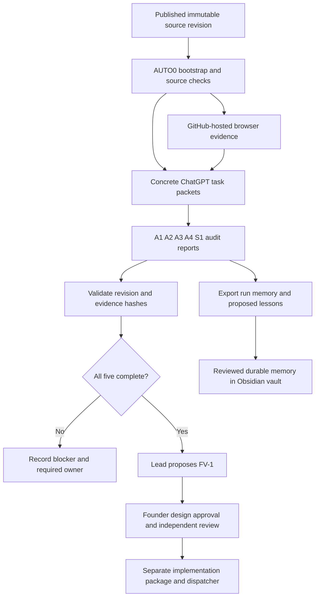

# ARO autonomous delivery system

## Current capability

AUTO0 is a repository execution foundation for existing ChatGPT cloud workers. It provides deterministic pinned-checkout setup, concrete task packets, source/evidence integrity checks, dependency gating and Obsidian-compatible memory. GitHub Actions supplies browser captures where the ChatGPT cloud sandbox cannot run Chromium. There are no model API calls or new API charges. Existing GitHub Actions usage still follows the repository's account limits.

This is audit autonomy, not unrestricted product implementation. Product writing remains blocked until the corresponding package, dependency evidence and founder/product-design decisions are recorded. The tool returns implementationEligible=false even after every audit report is present. It does not auto-merge code or reinterpret learned notes as authorization.

## Execution flow

A workflow passing means evidence was collected; it does not mean A1–A3 acceptance is complete. Workers must distinguish what the capture covers, what they independently inspect and what is still missing. Current browser evidence includes 15 direct routes (including an invalid ID), five widths, light/dark DOM themes, reduced-motion screenshots, link/control/image inventories, initial keyboard focus order, console/page errors and resource measurements. It does not yet prove full interaction, composited contrast, screen-reader behavior, animation parity or production performance.

## Operator and cloud dispatcher

1. Read [[AGENTS]], [[ARO_CLOUD_HANDOFF]] and [[specs/ARO-AUTO0-AUTONOMY-FOUNDATION]]. Use [[tools/autonomy/README]] for exact CLI commands.
2. Resolve a full audit SHA and approved AUTO0 tooling revision. Bootstrap in actual disposable cloud paths; source and output are separate. Never assume ChatGPT tasks share a mounted filesystem.
3. Find a successful **ARO audit evidence** workflow run for the audit SHA and retrieve its artifact. The workflow runs on relevant main source/tooling pushes and can be dispatched manually with an exact SHA. It uses read-only repository permissions and no provider secrets. It is a deterministic collector, not an AI worker.
4. Verify artifact manifest hashes and SHA, then supply captured evidence to A1–A3. If the cloud connector cannot retrieve it, report the retrieval blocker. Never disable policy controls or invent verification.
5. Run A1–A4 and S1 once. Each returns an exported report bundle plus its actual attachment link. Use existing ChatGPT cloud schedules only. A worker needing additional browser interactions reports those coverage gaps or requests another bounded evidence collection.
6. Lead downloads/imports all five bundles into its own run and executes status/check-source. It proceeds only when all dependencies are validated at the same SHA. If the cloud scheduler lacks dependency triggers, a coordinator may check report availability with a bounded follow-up; no blind clock-based synthesis.
7. C1 runs weekly Monday 09:00 America/Edmonton, resolves a fresh immutable main revision and retrieves its prior checkpoint. Notify on actionable changes/failures only. Missing prior state is reported explicitly.

## Learning and continuity

Open the repository as an Obsidian vault and start at [[ARO_HOME]] → [[memory/HOME]]. No Obsidian app is required in the cloud. The reviewed repository contains canonical lessons; run exports contain observations, failures, proposed lessons and source fingerprints. New lessons cannot alter authority, permissions, budgets or package eligibility. Independent evidence and a reviewed documentation change are required for promotion.

GitHub browser artifacts expire after 30 days. Cloud attachments also depend on their platform retention. The dispatcher must retain durable report exports/checkpoint links and publish reviewed lessons before transient evidence expires. AUTO0 does not claim perpetual memory or automatic access to private files in another conversation.

## Known cloud setup state, September 8

Cloud coordinator task: `6a9fbdd1-0584-83e8-89e5-27bb2d3e32db` (Schedule audit tasks).

- A4 schedule: `6a9fc0a87e1c8191a5eb946c5e1de1fe` — one-time cloud critique.
- S1 schedule: `6a9fc0b63a44819186b7627776426d92` — one-time cloud eligibility audit.
- C1 schedule: `6a9fc0ca3f14819191ddb24e1bbd6ff0` — weekly Monday 09:00 Edmonton.
- A1–A3 were not created because that cloud sandbox could not complete browser setup. AUTO0's GitHub evidence adapter must be verified and made retrievable before those schedules are enabled.
- Lead was not created because dependency completion/retrieval was not yet established.

These are historical reported scheduler states, not live guarantees. Confirm current state with the cloud coordinator before updating or creating schedules; avoid duplicates.
