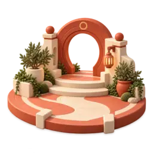

# Season 01 chapter art — prepared asset pack

Four original transparent 3D dioramas for **Awaken Your City**. This is a design asset handoff, not a runtime Season, earned reward, entitlement or completed package. Generated September 27, 2026 from the existing ARO Season scene and courtyard camera/material references. The original sources remain in `masters/`; `exports/` contains alpha WebP at 256px and 512px. `manifest.json` records dimensions, bytes, hashes, alpha and intended use.

| Chapter | Preview | Story cue | Suggested placement |
|---|---|---|---|
| Step Outside |  | A first step beyond the threshold | Chapter detail art; 512px at large size |
| Connect |  | A conversation can begin | Chapter detail art; 512px at large size |
| Contribute |  | Care and practical help | Chapter detail art; 512px at large size |
| Create |  | A new idea taking shape | Chapter detail art; 512px at large size |

Use these as **chapter illustrations**, with headings, action, progress and preview disclosure in semantic HTML. The complex silhouettes are too detailed to be relied upon as the sole 64px identifier. At 64px use the existing simple chapter icon and text; the diorama may be a decorative accompaniment. Do not add these images to `public/` or the initial route payload until the EF-S package is adopted, its asset budget measured and a product reviewer approves the art. Their narrative associations are not ownership or reward promises.

Production prompt lineage: premium adult-friendly matte ceramic miniature with bone, vermilion, moss and saffron; elevated three-quarter camera, warm daylight, rounded terracotta paving base, real transparent alpha, readable subject, no embedded text, badges, currency, human credentials, named city or landmark. The four subjects were separately generated: doorway/lantern/path; two chairs/table/cups; garden bench/sapling/tools; circular portal/blank idea cards. The existing `season-960.webp` and `courtyard-960.webp` were style references, not edit targets. The Connect master was then also a style/camera reference for the other three.

QA: masters are 1254×1254 RGBA with alpha 0–255; all eight exports decode as 256×256 or 512×512 sRGBA. Visually reviewed at 256px against a dark viewer surface. No visible city-specific bridge or text. All subjects remain fictional. Before actual UI integration, inspect against Bone/Ink/saturated QA backgrounds, text contrast, crops and image transfer on phones. Use controlled intrinsic dimensions and empty alt for decorative presentation; the markdown descriptions here are documentation only.
